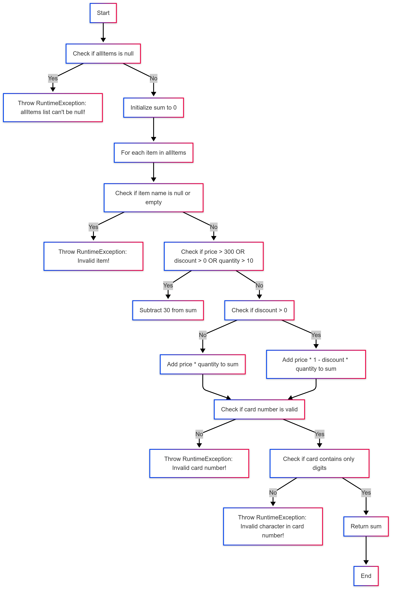

Aleksandar Ivanov 233134

Цикломатската комплексност е: 1 Ова значи дека функцијата има еден независен пат на извршување (без разгранување), што е нереално бидејќи јасно има разгранувања. Го занемаруваме бројот на условни јазли. Бројот на независни патеки се пресметува и како број на услови + 1. Во овој код има вкупно 8 услови (IF услови), што значи: V(G)=8+1=9 Цикломатската комплексност е 9. Ова значи дека кодот има 9 независни патеки на извршување.

Минимален број тест случаи: 6 (покриваат сите јазли 1-24). Тест случај 1: Празна листа Влез: allItems = [] cardNumber = "1234567890123456" Очекуван излез: sum = 0 Објаснување:Го покрива сценариото каде што листата на предмети е празна и се проверува валидацијата на бројот на картичката без циклус за предмети.

Тест случај 2: Невалидно име (null) Влез: allItems = [Item(null, 1, 100, 0)] cardNumber = "1234567890123456" Очекуван излез: Исклучок: RuntimeException("Invalid item!") Објаснување:Го покрива случајот кога името на предметот е null, предизвикувајќи исклучок.

Тест случај 3: Валиден предмет со попуст и одземање Влез: allItems = [Item("item1", 1, 100, 0.1)] cardNumber = "1234567890123456" Очекуван излез: sum = 100 * (1 - 0.1) * 1 - 30 = 90 - 30 = 60 Објаснување: Го покрива сценариото со попуст и дополнително намалување на сумата поради присуство на попуст.

Тест случај 4: Валиден предмет без попуст и без одземање Влез: allItems = [Item("item1", 1, 100, 0)] cardNumber = "1234567890123456" Очекуван излез: sum = 100 * 1 = 100 Објаснување: Го покрива основниот случај каде што предметот е валиден, нема попуст и не се одзема дополнителна сума.

Тест случај 5: Невалидна картичка (нецифрени знаци) Влез: allItems = [Item("item1", 1, 100, 0)] cardNumber = "123456789012345a" Очекуван излез: Исклучок: RuntimeException("Invalid character in card number!") Објаснување:Го покрива случајот каде што бројот на картичката содржи невалидни знаци (букви наместо цифри).

Тест случај 6: Невалидна картичка (погрешна должина) Влез: allItems = [Item("item1", 1, 100, 0)] cardNumber = "123" Очекуван излез: Исклучок: RuntimeException("Invalid card number!") Објаснување:Го покрива случајот каде што бројот на картичката не ја има потребната должина од 16 цифри.

// T1 - Ниеден услов не е исполнет new Item("Item1", 3, 150, 0.0); // false false false

// T2 - Само quantity > 10 new Item("Item2", 12, 150, 0.0); // false false true

// T3 - Само discount > 0 new Item("Item3", 3, 150, 0.15); // false true false

// T4 - discount и quantity исполнети new Item("Item4", 20, 150, 0.3); // false true true

// T5 - Само price > 300 new Item("Item5", 3, 500, 0.0); // true false false

// T6 - price и quantity исполнети new Item("Item6", 18, 450, 0.0); // true false true

// T7 - price и discount исполнети new Item("Item7", 3, 400, 0.25); // true true false

// T8 - Сите услови исполнети new Item("Item8", 20, 450, 0.25); // true true true

Објаснување на напишаните unit тестови: Statement coverage: Тестови за празна листа, невалидни имиња (null или празен стринг), артикли со и без попуст, и проверка на валиден/невалиден број на картичка. Цел: да се покријат сите линии од кодот барем еднаш.
Multiple condition coverage: Тестирање на сите комбинации на условите price > 300, discount > 0, и quantity > 10 кои влијаат на пресметката и одземањето на 30 од сумата. Цел: да се покријат сите логички комбинации во условите.

Валидација на број на картичка: Тестови кои фрлаат исклучок ако бројот не е 16 цифри или содржи недозволени карактери.
